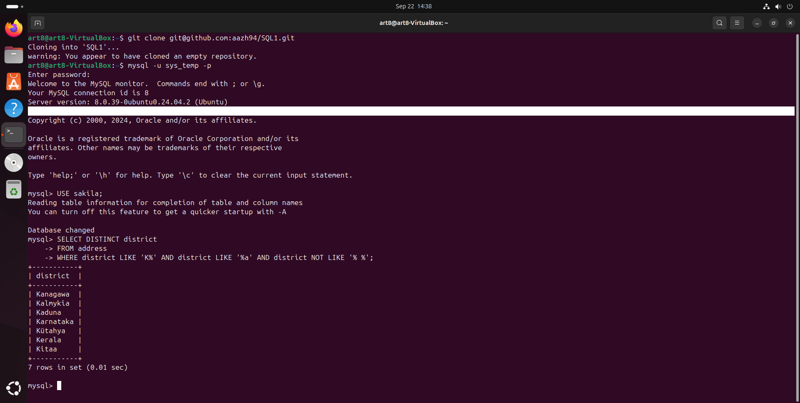

# Домашнее задание по SQL

## Задание 1: Уникальные названия районов
Запрос: 

SELECT DISTINCT district
FROM address
WHERE district LIKE 'K%' AND district LIKE '%a' AND district NOT LIKE '% %';

## Задание 2: Платежи с 15 июня 2005 года по 18 июня 2005 года
Запрос: 

SELECT *
FROM payment
WHERE payment_date BETWEEN '2005-06-15 00:00:00' AND '2005-06-18 23:59:59'
  AND amount > 10.00;

## Задание 3: Последние пять аренд фильмов
Запрос: 

SELECT *
FROM rental
ORDER BY rental_date DESC
LIMIT 5;

## Задание 4: Активные покупатели с именами Kelly или Willie
Запрос: 

SELECT 
    LOWER(REPLACE(first_name, 'LL', 'pp')) AS first_name, 
    LOWER(last_name) AS last_name
FROM customer
WHERE active = 1
  AND (first_name = 'Kelly' OR first_name = 'Willie');

